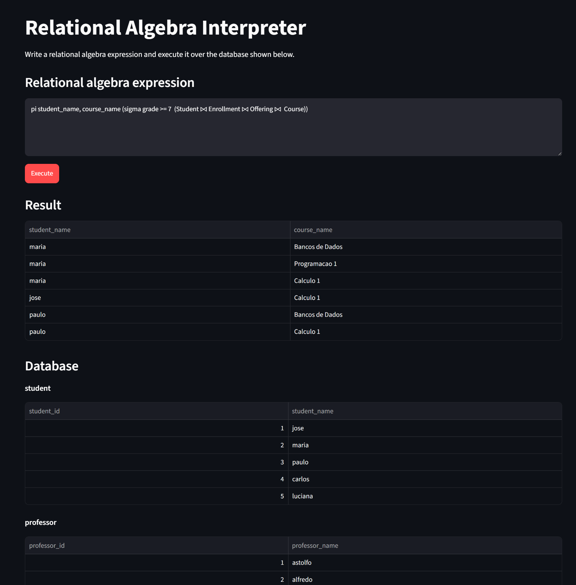

# pyrelax

A [RelaX](https://github.com/dbis-uibk/relax)-compatible relational-algebra query language.

Code is highly based on the original repository.

## Install

```bash
pip install .
```

## Demo

After installing, a web demo can be executed with:

```bash
pyrelax_demo
```

The demo loads a simple database and allows running relational algebra queries in the browser.



## Usage

```python
import pandas as pd
from pyrelax.engine import execute_query

database = {
    "Student": pd.DataFrame(...),
    "Course": pd.DataFrame(...),
    "Offering": pd.DataFrame(...),
    "Enrollment": pd.DataFrame(...),
}

## Students and courses in which they were approved.
result = execute_query("pi student_name, course_name (sigma grade >= 7  (Student ⨝ Enrollment ⨝ Offering ⨝  Course))", database)
```

Sample databases are provided:

```python
import pandas as pd
from pyrelax.engine import execute_query
from pyrelax.data import databases

# Load the database. The list of available databases can be inspected using databases.keys().
database = databases["Mutz - University"]

## Students and courses in which they were approved.
result = execute_query("pi student_name, course_name (sigma grade >= 7  (Student ⨝ Enrollment ⨝ Course))", database)
```

Most of the databases come from the [original Relax repository](https://github.com/dbis-uibk/relax). Some files were modified to make the syntax uniform.

## Known scope limits

- **Inline relation literals with rows** (e.g. `{ a:number | 1 }`) aren't
  supported — only the degenerate `{}` (TABLE_DUM) and `{()}`
  (TABLE_DEE). Build a pandas DataFrame and pass it in instead.

- **Relation-alias visibility stops at "boundary" operators.** A σ or a
  join condition can reference `alias.column` from any relation joined
  *directly* beneath it (e.g. `σ L.a = R.b (L ⨝ R)`), but once you cross
  a π, ρ (column rename), γ, τ, a set operator, or ÷, the old aliases
  are gone — matching real RA semantics for π (which drops relAlias
  anyway) but, as a deliberate simplification, also for the others. If
  you need an alias to survive past one of those, re-apply `ρ` after it.

- **`rownum()`** is only valid directly as a projected column
  (`π rownum() -> n (R)`); DuckDB needs it expressed as a window function
  (`ROW_NUMBER() OVER ()`), which isn't legal in a `WHERE`/join condition.

## Dependencies

- **[lark](https://github.com/lark-parser/lark)** for parsing (Earley   algorithm - the language has a couple of genuine local ambiguities,   e.g. `rho NAME (` vs `rho NAME <-`, which Earley resolves by simply   discarding  parses that don't lead to a complete, valid expression).

- **[DuckDB](https://duckdb.org/)** as the execution backend. Registering   a pandas DataFrame with DuckDB is one line   (`con.register(name, df)`) , and  in exchange we get correct, fast joins (incl. NATURAL/SEMI/ANTI/OUTER),  set operators, and three-valued NULL logic for free.

- [Streamlit](https://streamlit.io/) for the demo.